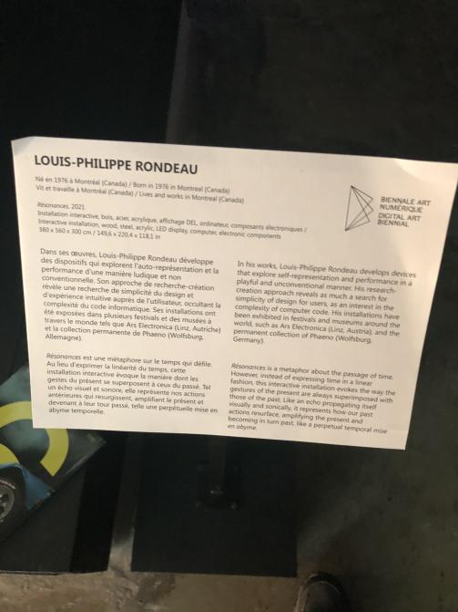
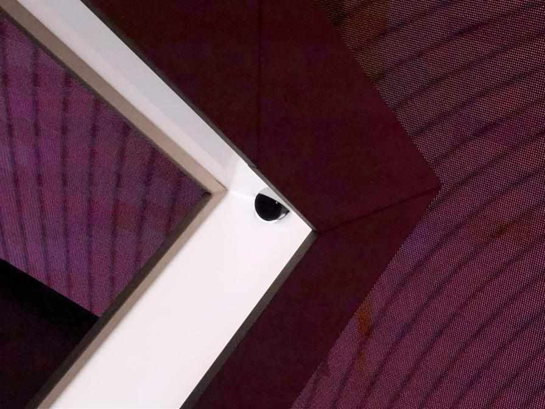
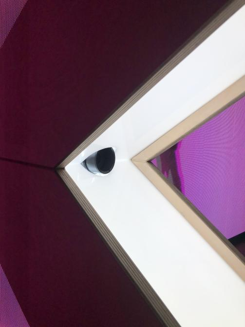
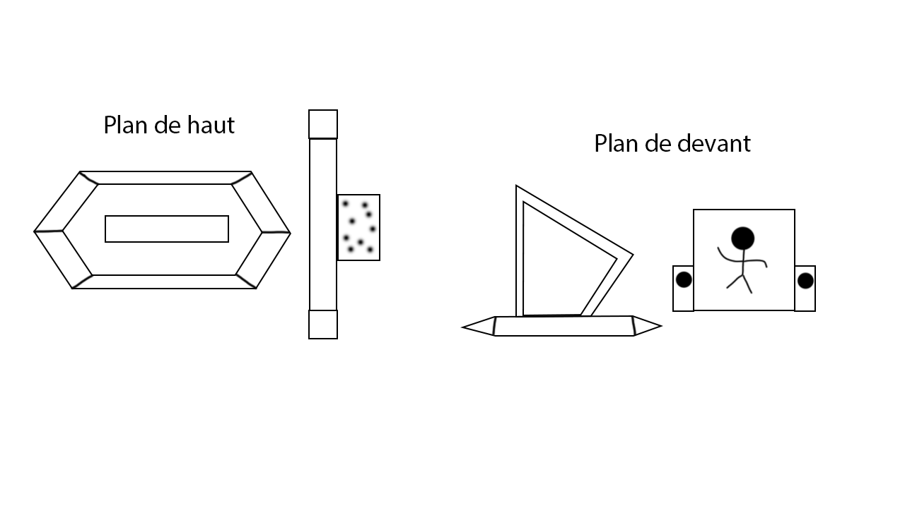
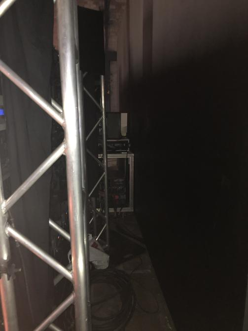

# Résonances

Photo de l'oeuvre Résonances, 2 Février 2023

Résonances est une oeuvre intéractive, permanente et intérieure faite par Louis-Phillipe Rondeau en 2021. Le nom Résonances est une métaphore sur le temps qui défile.

## Fonctionnement
Quand quelque'un marche à travers l'arche blanche, une image de la personnage qui a marché à travers l'arche apparaît à l'écran à droite de l'arche comme vu dans cette vidéo:

Ceci fonctionne grâce à un capteur de mouvement bien placé dans l'arche, qui permet de détecter le mouvement et le prendre en photo.

## Mise en espace
Résonances est situé dans une grande salle et l'installation en soi-même n'est pas connecté à des murs. C'est une oeuvre qui pourrait fonctionner au milieu d'une salle, mais pas à l'extérieur à cause de l'équipement utilisé pour l'oeuvre.

Voici un plan de l'oeuvre de haut et de devant l'oeuvre:

Voici une vidéo qui montre la mise en espace:
[Vidéo de la mise en espace](https://youtube.com/shorts/6muijECu_0g?feature=share)

## Équipement
Comme mentionné précédemment, cet oeuvre utilise un capteur de mouvement, mais c'est loin d'être tout. Un ordinateur caché derrière l'écran sert comme le cerveau de cet oeuvre pour tous contrôler, comme l'écran, le capteur de mouvement et l'appareil qui prend en vidéo le mouvement produit par un visiteur.

## Description
RÉSONANCES est une métaphore sur le temps qui défile. Toutefois, au lieu d’exprimer la linéarité du temps, cette installation interactive évoque la manière dont les gestes du présent se superposent à ceux du passé. Tel un écho visuel et sonore, RÉSONANCES représente nos actions antérieures qui resurgissent, amplifiant le présent, et devenant à leur tour passé, telle une perpétuelle mise en abyme temporelle. Cette boucle visuelle et sonore permet à l’interacteur de chorégraphier son présent en le construisant sur son propre passé, de manière ludique et singulière. La pièce a été dévoilée en décembre 2021 lors de l’exposition CORPS DATA à l’Ilot Balmoral en collaboration avec ELEKTRA. Elle a été présentée à la BIAN 6 (Biennale d’art numérique) à Arsenal art contemporain à Montréal en 2023. (Description provenant du [site de l'artiste](http://patenteux.com/wp/portfolio/resonances-2021/))
