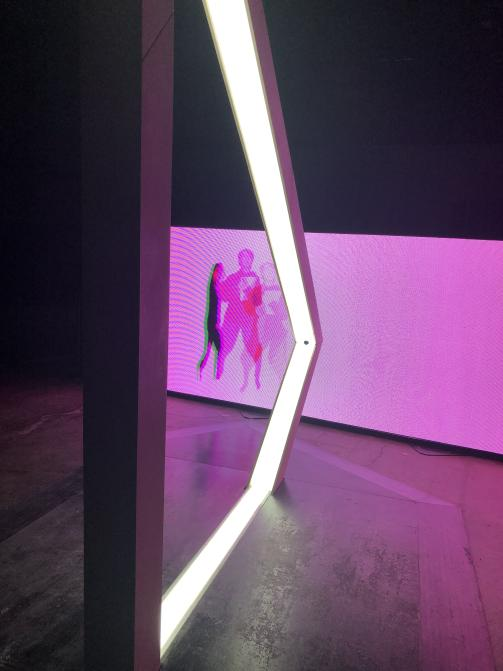

# Résonances

Photo de l'oeuvre Résonances, 2 Février 2023

Résonances est une oeuvre intéractive, permanente et intérieure faite par Louis-Phillipe Rondeau en 2021. Le nom Résonances est une métaphore sur le temps qui défile.

## Fonctionnement
Quand quelque'un marche à travers l'arche blanche, une image de la personnage qui a marché à travers l'arche apparaît à l'écran à droite de l'arche comme vu dans cette vidéo:

Ceci fonctionne grâce à un capteur de mouvement bien placé dans l'arche, qui permet de détecter le mouvement et le prendre en photo.

[Vidéo de Résonances en fonctionnement](https://youtube.com/shorts/pBfEmhubuzE?feature=shares)

## Mise en espace
Résonances est situé dans une grande salle et l'installation en soi-même n'est pas connecté à des murs. C'est une oeuvre qui pourrait fonctionner au milieu d'une salle, mais pas à l'extérieur à cause de l'équipement utilisé pour l'oeuvre.

Voici un plan de l'oeuvre de haut et de devant l'oeuvre:

Voici une vidéo qui montre la mise en espace:
[Vidéo de la mise en espace](https://youtube.com/shorts/6muijECu_0g?feature=share)

## Équipement
Comme mentionné précédemment, cet oeuvre utilise un capteur de mouvement, mais c'est loin d'être tout. Un ordinateur caché derrière l'écran sert comme le cerveau de cet oeuvre pour tous contrôler, comme l'écran, le capteur de mouvement et l'appareil qui prend en vidéo le mouvement produit par un visiteur.

## Description
RÉSONANCES est une métaphore sur le temps qui défile. Toutefois, au lieu d’exprimer la linéarité du temps, cette installation interactive évoque la manière dont les gestes du présent se superposent à ceux du passé. Tel un écho visuel et sonore, RÉSONANCES représente nos actions antérieures qui resurgissent, amplifiant le présent, et devenant à leur tour passé, telle une perpétuelle mise en abyme temporelle. Cette boucle visuelle et sonore permet à l’interacteur de chorégraphier son présent en le construisant sur son propre passé, de manière ludique et singulière. La pièce a été dévoilée en décembre 2021 lors de l’exposition CORPS DATA à l’Ilot Balmoral en collaboration avec ELEKTRA. Elle a été présentée à la BIAN 6 (Biennale d’art numérique) à Arsenal art contemporain à Montréal en 2023. (Description provenant du [site de l'artiste](http://patenteux.com/wp/portfolio/resonances-2021/))

## Expérience Personnelle
Quand on marche à travers l'arche, on se voit sur l'écran à droite de l'arche grâce à un capteur de mouvement.

Les capteurs de mouvements m'intrigues beaucoup car je n'arrive pas à comprendre comment qu'ils pourraient fonctionner. Habituellement, quand je vois quelque chose de multimédia comme cette oeuvre, une machine, un site web ou un jeu vidéo, j'ai relativement rapidement une bonne idée de comment que ça pourrait fonctionner, mais ce n'est pas le cas avec les capteurs de mouvements. En plus de ça, le capteur de mouvement prend des photos ou des vidéo quand un mouvement est détecté, ce qui m'impressionne encore plus. Ces deux aspects du capteur de mouvement et des photos (ou vidéo, je ne sais pas c'est lequel) m'inspirent à essayer de comprendre comment cette machine incroyable fonctionne et comment que je pourrais utiliser des capteurs de mouvements pour des machines multimédia dans le futur. 

Photo du capteur de mouvement:

Le seul aspect que je vais éviter d'utiliser comme inspiration de Résonances est le matériau utilisé pour faire la base de l'arche. Ça m'a l'air d'être fait avec du bois de chêne foncé et quelques clous, ce qui ne fittais pas bien avec l'arche blanche, illuminé et très technologique. C'est un gros contraste qui aurais pu bien fonctionner pour vraiment améliorer le design, mais je trouve que malheureuesement, cette décision de matériau m'a fait hésité une couple de fois à si je devrais marcher à travers l'arche ou si le bois allait s'écrouler sous mes pieds. Sans avoir été dit qu'on pouvait m'archer à travers l'arche ou sans avoir vu quelque'un marcher à travers l'arche, je ne pense pas que j'aurais imaginé que s'était une oeuvre intéractive, ce qui est, à mon avis, la faute de la base.

Photo où la base en bois est visible:

