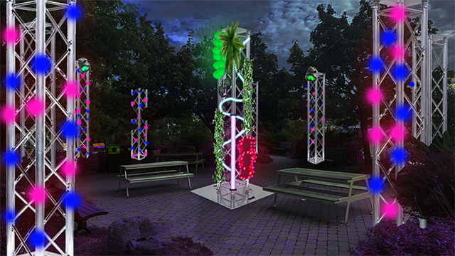

# EDRIA

Photo de l'oeuvre EDRIA prise le 23 février 2023, pendant le développement du projet (Note: la personne dans la photo ne fait pas partie de l'oeuvre)

## Lieu de mise en exposition
L'oeuvre est travaillée dessus dans le Grand Studio au collège Montmorency et elle sera mise en exposition proche de l'entrée à la salle André-Mathieu du collège Montmorency.

Photo de la vision finale de l'équipe qui développement EDRIA. [Leur page](https://tim-montmorency.com/2023/projets/EDRIA/docs/web/index.html)

## Type d'exposition
EDRIA sera une oeuvre extérieure qui sera également temporaire.

## Date de ma visite
J'ai visité l'équipe qui développement EDRIA le 23 février 2023.

## Artistes de EDRIA
EDRIA est le projet final de 6 étudiants du programme TIM qui sont à leur dernière session.
Ces élèves talentueux sont:
* [Elwin Durand](https://tim-montmorency.com/2023/projets/EDRIA/docs/web/journal_1.html)
* [Loic Delorme](https://tim-montmorency.com/2023/projets/EDRIA/docs/web/journal_2.html)
* [Dominic Roberts](https://tim-montmorency.com/2023/projets/EDRIA/docs/web/journal_3.html)
* [Gabriel Leblanc](https://tim-montmorency.com/2023/projets/EDRIA/docs/web/journal_4.html)
* [Meryem Berbiche](https://tim-montmorency.com/2023/projets/EDRIA/docs/web/journal_5.html)
* [Jean-Christophe Zephir](https://tim-montmorency.com/2023/projets/EDRIA/docs/web/journal_6.html)

## Année de réalisation
La conception a été faite durant la 5e session des étudiants en 2022 et la réalisation se fait durant la dernière (et 6e) session des étudiants en 2023.

## Description de EDRIA
